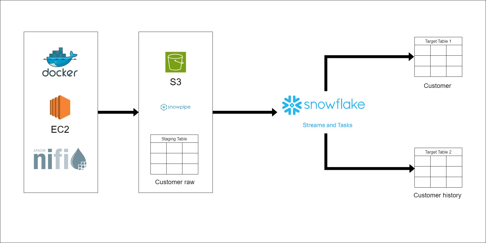

# Realtime-AWS-Nifi-Snowflake
Real time data streaming using Apache Nifi, AWS, Snowpipe, Stream and Task

## Architecture Diagram

## Overview

This project implements a real-time data streaming pipeline using Apache NiFi, AWS services, and Snowflake to ingest, process, and store fake generated data. The key components of the architecture are:

### Data Generation:
Real-time data is generated using a Python script and Faker library. The script runs on a scheduled basis using Apache NiFi to produce raw data.

### Data Ingestion:
Apache NiFi cluster running on Docker containers on AWS EC2 instances ingests the raw data when generated and stores it in Amazon S3 buckets.

### Stream Loading:
Snowpipe is used to automatically load the raw data from S3 into Snowflake as soon as files land in the defined location. This allows near real-time loading.

### Data Warehouse:
The raw data lands in Snowflake staging tables and streams before transformation. Snowflake tasks and streams are leveraged to transform the data and build SCD1 and SCD2 dimension tables for analysis.

In summary, the pipeline automates:
 - Real-time data generation
 - Streaming ingestion into cloud storage
 - Near real-time loading into a cloud data warehouse
 - Transformation for analysis using incremental ELT logic

The end result is a automated data pipeline ingesting and preparing data for consumption in near real-time.
